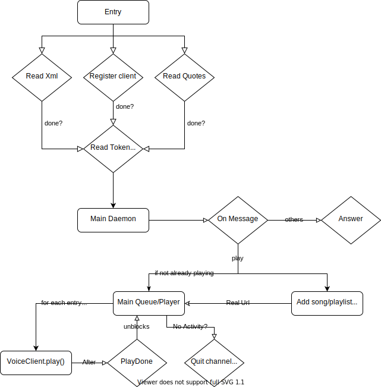

# SimBot, the simple Discord bot

## Overview:
SimBot is a template for a discord bot made and used by me and some friends, made improve their experience with the platform, having many functionalities built because of internal jokes. 
However, the bot is made in a generic way, where anyone can create their version for use with friends.

## Functionalities:
random quote: can generate a random quote from a pool in res/quotes.txt

multiple languages: by changing the text inside the tags in res/strings.xml, you can change what the bot says and what names the commands have.
play: still being implemented, will be able to enter in the channel the user is at and play a music from a youtube url

## How to run the bot:
After generating a token, paste it in a file in the "res" directory called "token", and, after installing the dependencies, run the bot with `python3 src/main.py`.

## Dependencies:
Install the discord package via pip. It also needs the random and xml.etree modules, but these should be installed by default.

## Licensing:
All files in this project are licensed under the BSD 3-Clause License, made in it's entirety by Lucas Eduardo Gulka Pulcinelli.

## Documentation:
So far, comments have been sparce, so this flow chart was created to help with understanding:

